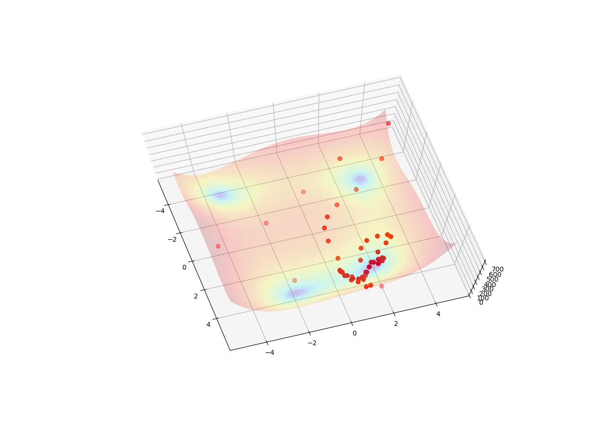
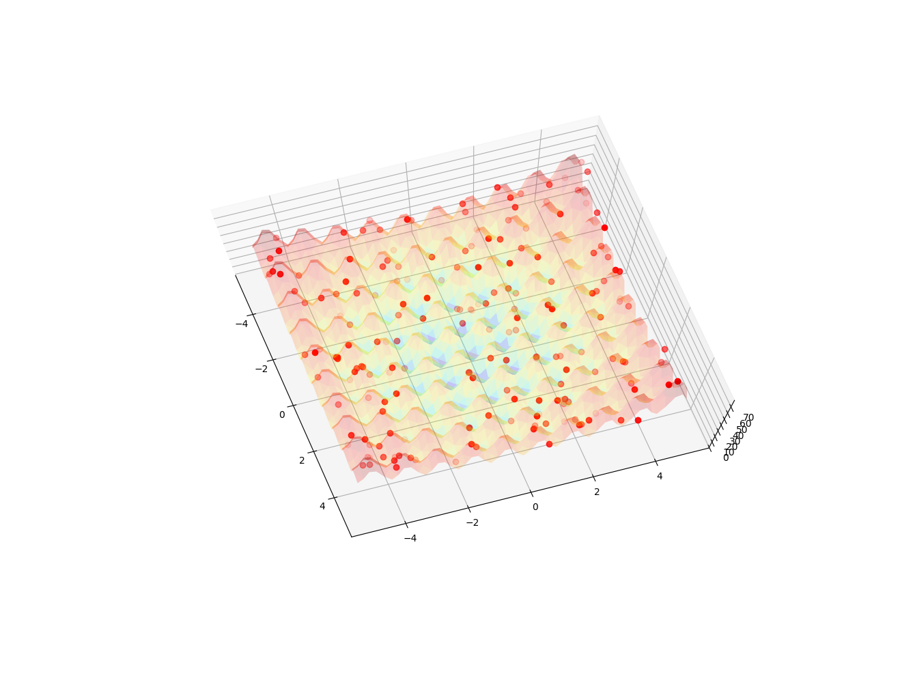

# Eddy
Eddy is a current ongoing collection of objective functions in euclidean space and various search strategies to find their extrema.
To make visualizations (e.g. 3D Plots or Manim-Videos) easy, objectives define much more information than just the pure function definition.
For example, they contain information about suggested visualization boundaries or their analytical or empirical known extrema.
Search strategies on the other hand provide capabilities to track their search path through space.
So it is easy to follow their search principles.
The main intent is to provide insights into the differences of various search strategies and how they behave in different artifcial landscapes.

 
# Installation
- Install from PyPi via poetry: ``poetry install eddy``
- Install latest development version: ``poetry add git+https://github.com/innvariant/eddy.git#master``
- Install with pip: ``pip install eddy``